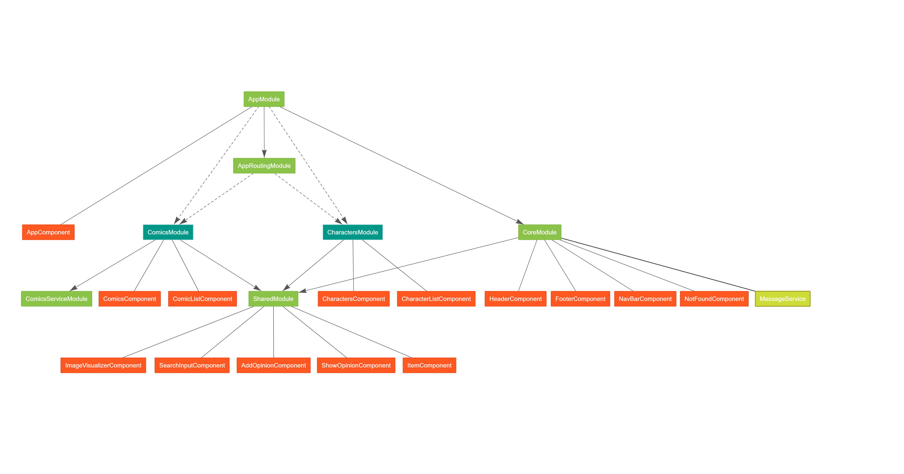

# MarvelDI

This project was generated with [Angular CLI](https://github.com/angular/angular-cli) version 7.1.3.
It uses [Bulma CSS framework](https://bulma.io/).

I used this app to practice with dependency injection.

## Development server

Run `ng serve` for a dev server. Navigate to `http://localhost:4200/`. The app will automatically reload if you change any of the source files.

## Build

Run `ng build` to build the project. The build artifacts will be stored in the `dist/` directory. Use the `--prod` flag for a production build.

## Build to [Github pages](https://pedrojesusromeroortega.github.io/MarvelDI)

``` bash
npm run build-gh
npx angular-cli-ghpages --dir=dist/MarvelDI
```

## Application View (generated with [ngrev](https://github.com/mgechev/ngrev))



## Structure

### Eager modules

#### AppModule

#### AppRoutingModule

#### CoreModule

##### CredentialsService

It will be instantiated when _ComicsService_ or _CharactersService_ are instantiated.

* Global singleton.
* Lazy.

##### HttpErrorHandler

It will be instantiated when _ComicsService_ or _CharactersService_ are instantiated.

* Global singleton.
* Lazy.

##### MessageService

It will be instantiated with CoreModule.
Is better to use providein:'root' in messageService.

* Global singleton.
* Eager.
* No treeshake.

#### SharedModule

### Lazy modules

#### ComicsModule

##### comicService

provideIn: lazyServiceModule

#### CharactersModule

##### characterService

providedIn: 'root',

##### CharactersComponent

_MessageService_ has it´s own instance for this component using _providers_.
In this way the opinions are particular to this component, not shared with Comics.
Try to comment to see that all opinions are shown without taking into account if you are in characters or comics.
